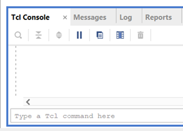

- Generate Project using TCL
    - Open Vivado, 
    
    - in TCL Console, navigate to this directory
        - command : `cd ../path/to/your/antminerGPIO/`
    - in TCL Console, start build project using `.tcl` script,
        - commad : `source antminerS9GPIO_vivado_proj.tcl`